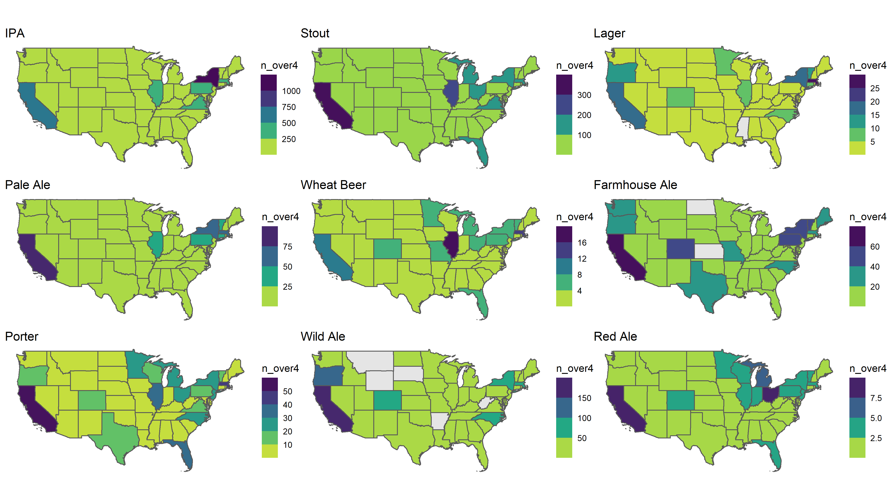
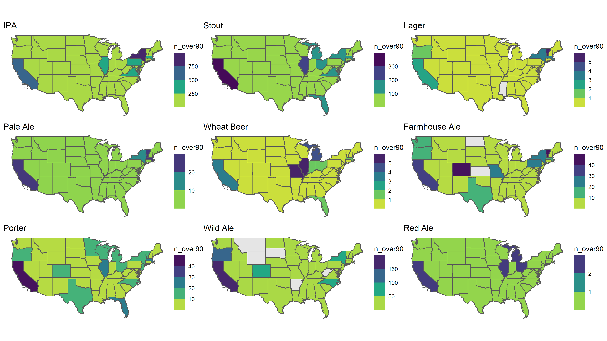

```{r setup, include=FALSE}
knitr::opts_chunk$set(echo = TRUE, message = FALSE, warning = FALSE)
```

The amazing [TidyTuesday](https://github.com/rfordatascience/tidytuesday) project has listed two beer-focused datasets this year, one focused on beer production by state, and the other on Great American Beer Fest (GABF) awards. 

From those, I was originally interested in joining the GABF awards data with beer reviews data from BeerAdvocate... but joining the data (off of brewery and beer names) has turned out to be messy and time consuming. So in the meantime, I wanted to share some data just from scraping Beer Advocate reviews. 

Scraping was a 3-part process:

1. I decided to scrape Beer Advocate reviews by first starting at the Beer Advocate [styles page](https://www.beeradvocate.com/beer/styles/), which lists 14 broad categories of beer styles, and over 100 unique substyles of beer. 
2. After scraping the links to these [individual style pages](https://www.beeradvocate.com/beer/styles/19/), I then scraped the beer tables for the top 5000 most-reviewed beers per substyle (if there were that many), for a total of roughly 216,000 different beers. I filtered that list down to nearly 47,000 beers that had more than 10 reviews. 
3. Finally, I pulled data from each beer's [individual review page](https://www.beeradvocate.com/beer/profile/140/2671/). 

Overall, I collected the following data for each beer:

* Name
* Brewery
* Link to Beer Advocate (BA) review
* ABV
* Number of ratings
* Average rating by BA users
* Overall BA score
* General style
* Substyle
* Brewery state

```{r}
library(tidytuesdayR)
library(rvest)
library(janitor)
library(tidyverse)
library(sf)
library(leaflet)
library(patchwork)
library(tidytext)
library(httr)

```


```{r include=FALSE, eval=FALSE}

gabf <- tt_load("2020-10-20")
production <- tt_load("2020-03-31")

gabf <- gabf$beer_awards

gabf2 <- gabf %>%
    mutate(brewery = str_remove(brewery, "-.+"),
           brewery = str_remove(brewery, " & Tasting Room"),
           brewery = str_remove(brewery, " & Grill"),
           brewery = str_remove(brewery, " & Kitchen"),
           brewery = str_remove(brewery, " & Brewpub"), 
           brewery = str_remove(brewery, " Co\\.|Company|Co/Ohio"),
           brewery = str_trim(brewery))

beer_states <- production$beer_states
beer_taxed <- production$beer_taxed
brewer_size <- production$brewer_size
brewing_materials <- production$brewing_materials

```


# Scraping the Styles
Scraping the styles information was straightforward -- go to the styles page, find the style html nodes, and pull the linked url from the attributes. 

Each style reviews page has a unique identifier number. I then created a dataframe that combined all of the style ID numbers with the page numbers of reviews. For example, page 2 of the American Barleywines style page is "https://www.beeradvocate.com/beer/styles/19/?sort=revsD&start=50" -- so I repeated the ending digits in steps of 50 from 0 to 5000 in order to get the 5000 most-reviewed beers per substyle. 

It would have been possible to pull either all the beers on BA or to pull it based on average rating, but since I was only interested in beers with more than 10 reviews (and I ended up collecting 4x the number of beers than I ended up using because they had fewer than 10 reviews, anyway) this strategy worked fine.

```{r eval=FALSE}
styles <- read_html(paste0("https://www.beeradvocate.com/beer/styles/")) 

style_nums <- styles %>%
    html_nodes("a") %>%
    html_attr("href") %>%
    tibble() %>%
    rename("links" = 1) %>%
    filter(str_detect(links, "styles/")) %>%
    mutate(style_num = parse_number(links)) %>%
    drop_na(style_num)


pages <- seq(from = 0, to = 5000, by = 50)

style_nums2 <- rep(style_nums$style_num, times = length(pages)) %>%
    enframe() %>%
    arrange(value) %>%
    pull(value)


pages2 <- rep(pages, times = (length(style_nums2) / length(pages)))

style_pages <- tibble(style_nums2, pages2)
    
```


# Scraping the Reviews
Next came scraping the tables from the individual style pages. It consisted of pulling the table itself and then adding in columns for the link to the individual beer pages as well as the beer substyle. I wrapped all of those pulls into a function that I then purrr::map2'd on the style_pages dataframe I created above (which contained all possible substyle review page urls).

```{r eval=FALSE}
get_reviews_style <- function(style_num, page){
  
  
  url <- read_html(paste0("https://www.beeradvocate.com/beer/styles/",
                          style_num, 
                          "/?sort=revD&start=", page) )
  
  stats <- url %>% 
      html_nodes("table") %>%
      html_table(fill = TRUE) %>%
      tibble() %>%
      unnest(".") %>%
      slice(-c(1:2)) %>%
      row_to_names(1) %>%
      remove_empty() %>%
      slice(1:n()-1)
  
  style <- url %>%
      html_node("h1") %>%
      html_text()
  
   beer_links <- url %>%
      html_nodes("a") %>%
      html_attr("href") %>%
      tibble() %>%
      rename("links" = 1) %>%
      filter(str_detect(links, "\\/beer\\/profile\\/\\d+\\/\\d+\\/")) %>%
      mutate(links = paste0("https://beeradvocate.com", links))
  
  
  stats <- stats %>%
      mutate(beer_style = style) %>%
      bind_cols(beer_links)
  
}

top_beers <- map2(style_pages$style_nums2, style_pages$pages2,
                  ~ get_reviews_style(.x, .y)) %>%
    bind_rows() 

## Clean and filter to only beers with > 20 ratings, adds broad style and substyle cols
top_beers2 <- top_beers %>%
  clean_names() %>%
  mutate(broad_style = str_extract(beer_style, ".+(?= - )"),
         sub_style = str_extract(beer_style, "(?<= - ).+"),
         broad_style = if_else(is.na(broad_style), beer_style, broad_style),
         sub_style = if_else(is.na(sub_style), beer_style, sub_style),
         ratings = parse_number(ratings),
         abv = parse_number(abv),
         avg = parse_number(avg),
         brewery = str_remove(brewery, "-.+"),
         brewery = str_remove(brewery, " & Tasting Room"),
         brewery = str_remove(brewery, " & Grill"),
         brewery = str_remove(brewery, " & Kitchen"),
         brewery = str_remove(brewery, " & Brewpub"),
         brewery = str_remove(brewery, " Co\\."),
         brewery = str_remove(brewery, " Company"),
         brewery = str_trim(brewery),
         across(c(abv, ratings,avg), as.numeric)) %>%
  filter(ratings > 10) %>%
  mutate(group_num = rep(1:10, each = 4692, length.out = nrow(.)))

```


```{r include=FALSE}
top_beers2 <- read_csv("C:\\data_projects\\non_defense_projects\\top_beers2.csv")
```


# Scrape Individual Beer Pages
Finally, there was a little more data from the beers' individual review pages that I also pulled. This included the brewery's state or country and the BA score (as opposed to BA users' average ratings). 

There is also code below to scrape the most recent 25 user reviews text, but I didn't end up running that code section for the analysis below, since pulling all of the data took > 6 hours as it was. I also had to break up that purrr::map() function into 5 separate pulls (although it's not reflected in the code chunk below) because I kept getting timeout errors from rvest connecting with the BA site. 


```{r eval=FALSE}
get_more_beer_info <- function(url){
  
  ## Brewery state, BA score
    state_names <- state.name
    country_names <- str_trim(ISOcodes::UN_M.49_Countries$Name)
    
    info <- read_html(url) %>%
        html_nodes("div") %>%
        html_text() %>%
        enframe() %>%
        mutate(value = str_remove_all(value, "\n"),
               value = str_replace(value, "Avail", " Avail")) %>%
        filter(str_detect(value, "^Beer Geek Stats:")) %>%
        mutate(state = str_extract(value, paste(state_names, collapse = "|")),
               country = str_extract(value, paste(country_names, collapse = "|")),
               score = str_extract(value, "(?<=Score:)\\d+"),
               links = url) 
    
    ## Most recent 25 user reviews
    reviews <- read_html(url) %>%
        html_nodes("#rating_fullview_content_2") %>%
        html_text() %>%
        enframe() %>%
        mutate(value = str_remove_all(value, ".+(?=overall:)"),
               value = str_remove_all(value, "\n")) %>%
        summarize(reviews = paste(value, collapse = "|")) %>%
        mutate(links = url)

      info %>%
          left_join(reviews, by = "links")
}      

## map across all beers in top_beers2 df
more_beer_info <- map_df(top_beers2$links, get_more_beer_info)

## join with top_beers2 df
top_beers3 <- top_beers2 %>%
    left_join(more_beer_info, by = "links") %>%
    mutate(score = as.numeric(score))

```


```{r include=FALSE, eval=FALSE}

gabf2 %>%
    left_join(top_beers3, by = c( "beer_name" = "name", "brewery" = "brewery"))

```


```{r include=FALSE}
top_beers3 <- read_csv("C:\\data_projects\\non_defense_projects\\top_beers3.csv")
```


# Analysis
Here are basic counts for how many beers we have in the final data by both broad style and substyle. LOTS of IPAs, although that should surprise no one :) The top four substyles are all IPAs or American pales.  

```{r}
top_beers3 %>%
    count(broad_style, sort = TRUE) %>%
    head(20)

top_beers3 %>%
    count(beer_style, sort = TRUE) %>%
    head(20)

```


## Comparing styles
First, let's take a look at the raw number and percent of each style that is either rated above a 4 by BA users or above a 90 in the BA score. Above a 90 indicates that a beer is either in the "Outstanding" or "World Class" categories. 

```{r}

## num/percent of beers > 4 rating
top_beers3 %>%
    group_by(broad_style) %>%
    summarize(n = n(),
              n_over4 = sum(avg >= 4, na.rm = TRUE),
              percent_over4 = round((n_over4 / n),2)) %>%
    filter(!is.na(broad_style)) %>%
    ggplot(aes(percent_over4, reorder(broad_style, percent_over4), fill = broad_style)) +
    geom_col() +
    theme_classic() + 
    theme(legend.position = "none",
          text = element_text(size=9))  +
    labs(y = "Beer Style", x = "Percent of Beers with an Average Rating >= 4", 
         title = "Percent of Beers with an Average Rating >= 4") +
    scale_x_continuous(labels = scales::percent_format()) 

top_beers3 %>%
    group_by(broad_style) %>%
    summarize(n = n(),
              n_over4 = sum(avg >= 4, na.rm = TRUE),
              percent_over4 = round((n_over4 / n),2)) %>%
    filter(!is.na(broad_style)) %>%
    ggplot(aes(n_over4, reorder(broad_style, n_over4), fill = broad_style)) +
    geom_col() +
    theme_classic() + 
    theme(legend.position = "none",
          text = element_text(size=9))  +
    labs(y = "Beer Style", x = "Number of Beers with an Average Rating >= 4",
         title = "Number of Beers with an Average Rating >= 4")

top_beers3 %>%
    group_by(broad_style) %>%
    summarize(n = n(),
              n_over90 = sum(score >= 90, na.rm = TRUE),
              percent_over90 = round((n_over90 / n),2)) %>%
    filter(!is.na(broad_style)) %>%
    ggplot(aes(percent_over90, reorder(broad_style, percent_over90), fill = broad_style)) +
    geom_col() +
    theme_classic() + 
    theme(legend.position = "none",
          text = element_text(size=9))  +
    labs(y = "Beer Style", x = "Percent of Beers with a BA Score >= 90",
         title = "Percent of Beers by General Style with a BA Score >= 90") +
    scale_x_continuous(labels = scales::percent_format())

```

Wild ales and lambics do well just about however you slice the data. Obviously the list of lambic brewers and blenders in the world is small, but it's still remarkable to have over 60% of a style rated as either outstanding or world class. 

The fact that the single highest number of amazing (4+ by reader ratings) IPAs speaks to the insane number of IPAs produced right now. And it's no surprise that stouts and wild ales are the second and (distant) third-place styles -- those are usually the kinds of beers we think of as hype whales. 

Also of note: based on reader averages, high-ABV styles like quads, (many) stouts, barleywines, and (some) IPAs are at or near the top of the list of the most 4+ rated beers. Again, these are whale-ish beers, like [Dark Lord](https://www.darklordday.com/), which costs $170 for *just five bottles*, [Hunahpu](https://www.cigarcitybrewing.com/beer/hunahpus/) or [Pliny the Younger](https://russianriverbrewing.com/pliny-the-younger/). 


What about the distribution of reviews within a style? Using boxplots and the interquartile range, we can take a look at the most and least-divisive beer styles. The idea here is that beer ratings for some styles are more clustered together than others, while some styles have both very high and very low-rated beers. 

```{r}
## distribution of reviews
top_beers3 %>%
    filter(!is.na(broad_style)) %>%
    ggplot(aes(avg, reorder(broad_style, avg), color = broad_style)) + 
    #geom_jitter(aes(alpha = 0.3)) + 
    geom_boxplot() + 
    theme_classic() + 
    theme(legend.position = "none",
          text = element_text(size=9))  +
    labs(y = "Beer Style", x = "Avg Rating")

## Most divisive styles (within-style IQR)
top_beers3 %>%
    group_by(broad_style) %>%
    summarize(iqr = IQR(avg)) %>%
    filter(!is.na(broad_style)) %>%
    arrange(desc(iqr)) %>%
    slice_max(order_by = iqr, n = 20) %>%
    ggplot(aes(iqr, reorder(broad_style, iqr), color = broad_style)) +
    geom_point() + 
    geom_segment(aes(x = 0, xend = iqr, y = broad_style, yend = broad_style)) +
    theme_classic() +
    theme(panel.grid.major.y = element_blank(),
          panel.border = element_blank(),
          axis.ticks.y = element_blank(), 
          legend.position = "none",
          text = element_text(size=9)) +
    labs(x = "Interquartile range", y = "Beer Style",
         title = "Most Divisive Beer Styles")

## Most divisive substyles (within-style IQR)
top_beers3 %>%
    group_by(beer_style) %>%
    summarize(iqr = IQR(avg)) %>%
    filter(!is.na(beer_style)) %>%
    arrange(desc(iqr)) %>%
    slice_max(order_by = iqr, n = 20) %>% 
    ggplot(aes(iqr, reorder(beer_style, iqr), color = beer_style)) +
    geom_point() + 
    geom_segment(aes(x = 0, xend = iqr, y = beer_style, yend = beer_style)) +
    theme_classic() +
    theme(panel.grid.major.y = element_blank(),
          panel.border = element_blank(),
          axis.ticks.y = element_blank(), 
          text = element_text(size=9),
          legend.position = "none") +
    labs(x = "Interquartile range", y = "Beer substyle",
         title = "Most Divisive Beer Substyles")

# Least divisive substyles (within-style IQR)
top_beers3 %>%
    group_by(beer_style) %>%
    summarize(iqr = IQR(avg)) %>%
    filter(!is.na(beer_style)) %>%
    arrange(desc(iqr)) %>%
    slice_min(order_by = iqr, n = 20) %>%
    ggplot(aes(iqr, reorder(beer_style, -iqr), color = beer_style)) +
    geom_point() + 
    geom_segment(aes(x = 0, xend = iqr, y = beer_style, yend = beer_style)) +
    theme_classic() +
    theme(panel.grid.major.y = element_blank(),
          panel.border = element_blank(),
          axis.ticks.y = element_blank(), 
          text = element_text(size=9),
          legend.position = "none") +
    labs(x = "Interquartile range", y = "Beer substyle",
         title = "Least Divisive Beer Substyles")    


    
```

Some thoughts here:

* The median wild ale is likely to be pretty good. These beers, like quads, lambics and brett beers, are difficult and/or take a long time to produce. Essentially, the brewer usually has to be pretty accomplished to make and sell one of these styles, so it's likely to be pretty good. And of course, those long production times and large amounts of raw materials mean that these beers are often more expensive than most. So, since these are consumer reviews, it's likely that drinkers either somewhat, if unconsciously, inflate their ratings to justify the cost, or just have a higher perceived enjoyment of the beer just because the beer style and marketing signal that it *should* be a good beer. 
* Light lagers like Bud and High Life are among the most divisive beers. Based on a previous [analysis](https://nycdatascience.com/blog/student-works/american-beers-scraping-data-different-american-ales-cheap-lagers/) it looks like some of this variation can be explained by joke reviews. Other kinds of lagers are also divisive, including European dark lagers (like Dunkels, Schwarzbiers, and Tmave Pivos), Dortmunders, and Japanese rice lagers. I think this may be partly because even some of the best lagers have less intense flavors than something like an IPA, and partly because lagers as a broad category often get lumped together with light lagers. 
* Other divisive styles, like Kvass, Lambic, and Gueuze, may be much different than anything a drinker has ever had before. They're often sour, smell funky (with descriptors like "horse blanket" and "barnyard"), and are rare, so they're unlike most other beer styles that people have tried before. 
* But interestingly, some of those similarly-rare styles like smoked porter, braggot, brett beer, and Biere de Garde are among the least-divisive styles. In part I think this is because these styles are comparatively rare, so the sample size of available beers is lower. And I'd argue that unlike Lambic/Gueuze, they're rare enough that many people might not get randomly offered one at some point, like a Lambic. For example, fruited Lambics are available at a lot of fancy grocery stores, and I *wouldn't* think it would be uncommon for a beer geek friend to share a gueuze with people who aren't as in to beer, because of the style's reputation and because they're nice for special occasions. Basically, for the least-divisive styles, the kinds of people that usually review them on Beer Advocate are also their biggest fans. You don't *typically* just stumble onto a brett beer sight unseen.


## The relationship between ABV and ratings
As noted above, high-ABV beer styles are often highly-rated, but what about higher-ABV beers within a style? 

```{r}
## ABV vs. ratings (broad style and beer style)
top_styles <- top_beers3 %>%
    count(broad_style, sort = TRUE) %>%
    top_n(9)

top_beers3 %>%
    filter(broad_style %in% top_styles$broad_style,
           abv < 20) %>%
    ggplot(aes(abv, avg)) + 
    geom_point(aes(alpha = 0.4, color = broad_style)) +
    geom_smooth() +
    facet_wrap(~broad_style, scales = "free_x") +
    theme_classic() + 
    theme(panel.grid.major.y = element_blank(),
          panel.border = element_blank(),
          axis.ticks.y = element_blank(), 
          legend.position = "none") + 
    labs(y = "Avg Rating", x = "ABV", title = "ABV vs. Avg User Rating by General Style")

top_styles <- top_beers3 %>%
    count(beer_style, sort = TRUE) %>%
    top_n(9)


top_beers3 %>%
    filter(abv < 20,
           beer_style %in% top_styles$beer_style) %>%
    ggplot(aes(abv, avg)) + 
    geom_point(aes(alpha = 0.4, color = beer_style)) +
    geom_smooth() +
    facet_wrap(~beer_style, scales = "free_x") +
    theme_classic() + 
    theme(panel.grid.major.y = element_blank(),
          panel.border = element_blank(),
          axis.ticks.y = element_blank(), 
          legend.position = "none") + 
    labs(y = "Avg Rating", x = "ABV", title = "ABV vs. Avg User Rating by Substyle")
```

In general, for most of the top-9 styles, there's not a strong relationship between ABV and average BA user rating. However, for stouts, wheat beers, and porters, there is a small positive correlation. Interestingly, for substyles, there's not as strong of a relationship between ABV and rating for double IPAs as for imperial stouts. 

## Top breweries by style
We can also look at the top breweries by style. Here I use mean rating by style for brewers that have at least two beers with 10+ reviews on Beer Advocate. 


```{r}
## top breweries by style (brewery has to have 3 or more examples)
library(tidytext)

top_styles <- top_beers3 %>%
    count(broad_style, sort = TRUE) %>%
    top_n(9)

top_beers3 %>%
    group_by(broad_style, brewery) %>%
    summarize(n = n(),
              avg_rating = round(mean(avg, na.rm = TRUE), 2)) %>%
    filter(n > 2,
           !is.na(broad_style),
           broad_style %in% top_styles$broad_style) %>%
    group_by(broad_style) %>%
    slice_max(n = 10, order_by = avg_rating) %>%
    ggplot(aes(avg_rating, reorder_within(brewery, avg_rating, broad_style), 
               color = broad_style)) +
    geom_point() +
    geom_segment(aes(x = 0, xend = avg_rating, 
                     y = reorder_within(brewery, avg_rating, broad_style), 
                     yend = reorder_within(brewery, avg_rating, broad_style))) +
    facet_wrap(~broad_style, scales = "free_y") +
    scale_y_reordered() + 
    theme_classic() + 
    theme(panel.grid.major.y = element_blank(),
          panel.border = element_blank(),
          axis.ticks.y = element_blank(), 
          text = element_text(size=9),
          legend.position = "none") +
    labs(x = "Average Rating", y = "Brewery", title = "Top Breweries by Style")


top_styles <- top_beers3 %>%
    count(beer_style, sort = TRUE) %>%
    top_n(9)

top_beers3 %>%
    group_by(beer_style, brewery) %>%
    summarize(n = n(),
              avg_rating = round(mean(avg, na.rm = TRUE), 2)) %>%
    filter(n > 2,
           !is.na(beer_style),
           beer_style %in% top_styles$beer_style) %>%
    group_by(beer_style) %>%
    slice_max(n = 10, order_by = avg_rating) %>%
    ggplot(aes(avg_rating, reorder_within(brewery, avg_rating, beer_style), 
               color = beer_style)) +
    geom_point() +
    geom_segment(aes(x = 0, xend = avg_rating, 
                     y = reorder_within(brewery, avg_rating, beer_style), 
                     yend = reorder_within(brewery, avg_rating, beer_style))) +
    facet_wrap(~beer_style, scales = "free_y") +
    scale_y_reordered() + 
    theme_classic() + 
    theme(panel.grid.major.y = element_blank(),
          panel.border = element_blank(),
          axis.ticks.y = element_blank(), 
          text = element_text(size=7),
          legend.position = "none") +
    labs(x = "Average Rating", y = "Brewery", title = "Top Breweries by Substyle")

```

# BAR: Beers Above Replacement
What if we do the above analysis, but instead take the z-scores of each beer's avg rating and score, adjusted for the broad style and substyle? 

```{r}
top_beers4 <- top_beers3 %>%
    group_by(broad_style) %>% 
    mutate(avg_scaled_broad_style = scale(avg),
           score_scaled_broad_style = scale(score)) %>% 
    group_by(beer_style) %>%
    mutate(avg_scaled_beer_style = scale(avg),
           score_scaled_beer_style = scale(score)) %>%
    ungroup()


top_styles <- top_beers4 %>%
    count(broad_style, sort = TRUE) %>%
    top_n(9)

top_beers4 %>%
    group_by(broad_style, brewery) %>%
    summarize(n = n(),
              avg_rating = round(mean(avg_scaled_broad_style, na.rm = TRUE), 2)) %>%
    filter(n > 2,
           !is.na(broad_style),
           broad_style %in% top_styles$broad_style) %>%
    group_by(broad_style) %>%
    slice_max(n = 10, order_by = avg_rating) %>%
    ggplot(aes(avg_rating, reorder_within(brewery, avg_rating, broad_style), 
               color = broad_style)) +
    geom_point() +
    geom_segment(aes(x = 0, xend = avg_rating, 
                     y = reorder_within(brewery, avg_rating, broad_style), 
                     yend = reorder_within(brewery, avg_rating, broad_style))) +
    facet_wrap(~broad_style, scales = "free_y") +
    scale_y_reordered() + 
    theme_classic() + 
    theme(panel.grid.major.y = element_blank(),
          panel.border = element_blank(),
          axis.ticks.y = element_blank(), 
          text = element_text(size=9),
          legend.position = "none") +
    labs(x = "Average Rating", y = "Brewery", title = "Top Breweries by Style")
```

The idea of BAR gets interesting when you look at individual beers. For example: 

```{r}

top_beers4 %>%
    filter(brewery == "Sierra Nevada Brewing") %>% 
    ggplot(aes(avg, avg_scaled_broad_style, label = name, color = broad_style)) + 
    geom_point() + 
    ggrepel::geom_text_repel(size = 3, data = subset(top_beers4 %>%
    filter(brewery == "Sierra Nevada Brewing"), avg_scaled_broad_style > 0.7 )) + 
    theme_classic() +
    theme(panel.grid.major.y = element_blank(),
          panel.border = element_blank(),
          axis.ticks.y = element_blank(), 
          #text = element_text(size=9),
          legend.position = "none") +
    labs(x = "Average Rating", y = "Scaled Avg Rating", title = "Comparing Sierra Nevada's BAR vs. Avg Rating")

```

As you can see from the scatterplot above, some beers are much better scaled to their style of beer compared to their rating overall. The big winner are Kellerweis, the Ovila series, their most recent Oktoberfest, and many of their lagers. Many of these beers are less popular styles that have just solid ratings overall, but are amazing within their style.

Further, the best beers in the country change significantly too. 

```{r}
top_beers4 %>%
    slice_max(order_by = avg, n = 25) %>%
    ggplot(aes(avg, avg_scaled_broad_style, label = name, color = broad_style)) + 
    geom_point() + 
    ggrepel::geom_text_repel(size = 3, data = subset(top_beers4 %>% slice_max(order_by = avg, n = 25), avg_scaled_broad_style > 2.7 | avg_scaled_broad_style < 2)) + 
    theme_classic() +
    theme(panel.grid.major.y = element_blank(),
          panel.border = element_blank(),
          axis.ticks.y = element_blank(),
          legend.title = element_blank()) +
    labs(x = "Average Rating", y = "Scaled Avg Rating", title = "Top Avg Beers")


top_beers4 %>%
    slice_max(order_by = avg_scaled_broad_style, n = 25) %>%
    ggplot(aes(avg, avg_scaled_broad_style, label = name, color = broad_style)) + 
    geom_point() + 
    ggrepel::geom_text_repel(size = 3, data = subset(top_beers4 %>% slice_max(order_by = avg_scaled_broad_style, n = 25), avg_scaled_broad_style > 2.7 | avg_scaled_broad_style < 2)) + 
    theme_classic() +
    theme(panel.grid.major.y = element_blank(),
          panel.border = element_blank(),
          axis.ticks.y = element_blank(),
          legend.title = element_blank()) +
    labs(x = "Average Rating", y = "Scaled Avg Rating", title = "Top BAR Beers")


```

If you just take the top 25 beers in the country, they fall into one of just 5 broad beer styles, and three of those styles have just a single example. Basically, all of the top-rated beers are either IPAs or stouts! 

But if you look at the scaled by style top-25, there are 13 styles represented. There are still some of the top overall rated beers like King Julius, Twice the Daily Serving: Raspberry, and Kentucky Brunch Brand Stout, but also a large number of beers that are highly rated but in less whale-y styles, like Yellow Doctor and Maple in the Wood. 


## Top brewers in the country
To me, one of the signs of a truly amazing brewer is that you can buy any beer they make, no matter the style, and have confidence that it'll be a great beer. Creature Comforts, which is local to me (well, was, when I lived in Athens), is one of those breweries for me, along with Sierra Nevada. 

So, the following charts look at breweries that have top-20-rated beers in multiple styles. This is just one way to look at best breweries, but I think the results track pretty closely with who you'd expect.

```{r}
## (number of styles that a brewery has a top 20 avg rating in)
top_beers4 %>%
    group_by(broad_style, brewery) %>%
    summarize(n = n(),
              avg_rating = round(mean(avg_scaled_broad_style, na.rm = TRUE), 2)) %>%
    filter(n > 2) %>% 
    group_by(broad_style) %>% 
    slice_max(order_by = avg_rating, n = 20) %>%
    ungroup() %>%
    count(brewery, sort = TRUE) %>%
    slice_max(order_by = n, n = 20) %>%
    ggplot(aes(n, reorder(brewery,n),  fill = n)) + 
    geom_col() + 
    theme_classic() + 
    theme(panel.grid.major.y = element_blank(),
          panel.border = element_blank(),
          axis.ticks.y = element_blank(), 
          text = element_text(size=10),
          legend.position = "none") +
    scale_fill_viridis_b(direction = -1) +
    labs(x = "Number of Styles w/ Top 20 Avg Rating", y = "Brewery",
         title = "Breweries That Are Awesome at Multiple Styles (Avg Rating")

## By score > Rating
top_beers4 %>%
    group_by(broad_style, brewery) %>%
    summarize(n = n(),
              avg_rating = round(mean(score_scaled_broad_style, na.rm = TRUE), 2)) %>%
    filter(n > 2) %>% 
    group_by(broad_style) %>% 
    slice_max(order_by = avg_rating, n = 20) %>%
    ungroup() %>%
    count(brewery, sort = TRUE) %>%
    slice_max(order_by = n, n = 20) %>%
    ggplot(aes(n, reorder(brewery,n),  fill = n)) + 
    geom_col() + 
    theme_classic() + 
    theme(panel.grid.major.y = element_blank(),
          panel.border = element_blank(),
          axis.ticks.y = element_blank(), 
          text = element_text(size=10),
          legend.position = "none") +
    scale_fill_viridis_b(direction = -1) +
    labs(x = "Number of Styles w/ Top 20 Avg Score", y = "Brewery",
         title = "Breweries That Are Awesome at Multiple Styles (Avg Score")


top_beers4 %>%
    group_by(beer_style, brewery) %>%
    summarize(n = n(),
              avg_rating = round(mean(avg_scaled_beer_style, na.rm = TRUE), 2)) %>%
    filter(n > 2) %>% 
    group_by(beer_style) %>% 
    slice_max(order_by = avg_rating, n = 10) %>%
    ungroup() %>%
    count(brewery, sort = TRUE) %>%
    slice_max(order_by = n, n = 20) %>%
    ggplot(aes(n, reorder(brewery,n),  fill = n)) + 
    geom_col() + 
    theme_classic() + 
    theme(panel.grid.major.y = element_blank(),
          panel.border = element_blank(),
          axis.ticks.y = element_blank(), 
          text = element_text(size=10),
          legend.position = "none") +
    scale_fill_viridis_b(direction = -1) +
    labs(x = "Number of Beer Substyles w/ Top 20 Avg Rating", y = "Brewery",
         title = "Breweries That Are Awesome at Multiple Substyles")


```

Trillium, Jackie O's, Hill Farmstead, Tree House, Suarez, Sante Adairius, Holy Mountain, Side Project... these are all who you'd probably shortlist for the best breweries in the country.

## Best breweries by state / state specialties
[Beervana's Jeff Alworth](https://www.beervanablog.com/) often likes to talk about beer being part of, and a reflection of, culture -- and as a result, places develop local and regional specialties. 

Even with large regional craft breweries like New Belgium or Boston Beer, states still develop local specialties -- like IPAs and Pilsners in Oregon and NE IPAs in Vermont and Massachusetts.

So let's make some maps. First we'll make a basemap of the lower 48 states using the tigris package. 


```{r results = "hide"}
library(tigris)  
library(sf)
library(leaflet)
  
us <- states(cb = TRUE, progress_bar = FALSE)  
drop_states <- c("Commonwealth of the Northern Mariana Islands", 
                 "United States Virgin Islands",
                 "Alaska", "Hawaii", "American Samoa", "Guam", "Puerto Rico")

us2 <- us %>%
    filter(!NAME %in% drop_states) %>%
    st_set_crs("4326")
```

Then we can find the top states per style -- we'll look at states with the most beers in a style (for the top 9 styles) either rated over 4 by users or over 90 by the BA score. 

```{r eval = FALSE}
## top states per style
top_styles <- top_beers3 %>%
    count(broad_style, sort = TRUE) %>%
    top_n(9)

beer_state_styles <- top_beers3 %>%
    group_by(broad_style, state) %>%
    summarize(n_beers = n(),
              n_over4 = sum(avg >= 4, na.rm = TRUE),
              n_over90 = sum(score >= 90, na.rm = TRUE),
              avg_rating = round(mean(avg, na.rm = TRUE), 2)) %>%
    filter(broad_style %in% top_styles$broad_style) %>%
    right_join(us2, by = c("state" = "NAME")) %>%
    st_sf(sf_column_name = "geometry", crs = 4326)
    

maps <- map(top_styles$broad_style, ~ ggplot(beer_state_styles) + 
    geom_sf() +
    geom_sf(data = beer_state_styles %>% filter(broad_style == .x), 
            aes(fill = n_over4)) +
    scale_fill_viridis_b(direction = -1) + 
    theme_void() +
    ggtitle(.x))

wrap_plots(maps)


maps2 <- map(top_styles$broad_style, ~ ggplot(beer_state_styles) + 
    geom_sf() +
    geom_sf(data = beer_state_styles %>% filter(broad_style == .x), 
            aes(fill = n_over90)) +
    scale_fill_viridis_b(direction = -1) + 
    theme_void() +
    ggtitle(.x))

wrap_plots(maps2)

```

{width=90% height=90%}

{width=90% height=90%}


It's not a surprise that California is an IPA hotbed... but what about New York? And the lack of Oregon or Washington? For Oregon, I'm guessing it has to be because there are a bunch of highly-rated IPAs, but they don't have more than 10 reviews, particularly because breweries are incentivized to constantly churn out new one-off beers (in 4-packs of 16oz cans with sticker labels, of course). Or -- maybe Beer Advocate just isn't as big of a thing in Oregon compared to other places like New York. *shruggie emoji* 

Oregon's awesome lager and wild/farmhouse ale breweries (get you a brewery -- pFriem -- that can do both IMO..) do come through in some of the other maps, though.

Also, note Texas coming through in farmhouse ales -- that's almost 100% just Jester King! 

Another funny note -- Florida is particularly strong in porters and stouts -- not beers you'd necessarily associate with warm weather and the beach, but breweries like Angry Chair, J. Wakefield Brewing, Cigar City, and Funky Buddha all have amazing dark beers.


## Style-specific interactive maps
We can also make an interactive map for the whole country for a single style. Where would you go to find the best pilsners? 

Note that the map has hover-over tooltips that show the number of beers with scores > 90 and ratings > 4, as well as average ratings and the top beer in that style in the state.

```{r}
## leaflet map - Pilsners

make_leaflet <- function(style) { 
  
style_scores <- top_beers3 %>%
    filter(broad_style == style) %>%
    group_by(state) %>%
    summarize(n_beers = n(),
              n_over4 = sum(avg >= 4, na.rm = TRUE),
              n_over90 = sum(score >= 90, na.rm = TRUE),
              avg_rating = round(mean(avg, na.rm = TRUE), 2)) %>%
    left_join(top_beers3 %>%
        filter(broad_style == style) %>%
        group_by(state) %>%
        slice_max(order_by = avg, n = 1) %>%
        mutate(name = paste(brewery, name, sep = ": ")) %>%
        select(top_beer = name)) %>%
    right_join(us2, by = c("state" = "NAME")) %>%
    st_sf(sf_column_name = "geometry", crs = 4326)


pal <- colorBin("viridis", style_scores$n_over90, pretty = TRUE, reverse = TRUE)


leaflet(style_scores) %>%
  addProviderTiles(providers$Stamen.TonerLite,
                   options = providerTileOptions(minZoom = 2, maxZoom = 5)) %>%
  addPolygons(fillColor = ~ pal(n_over90),
              weight = 0.5, opacity = 1,
              color = "black",
              fillOpacity = 0.5, smoothFactor = 0.5,
              label = paste0("N reviews > 4 = ", style_scores$n_over4, ", ",
                             "N scores > 90 = ", style_scores$n_over90, ", ",
                              "Avg Rating = ", style_scores$avg_rating, ", ",
                             "Top beer: ", style_scores$top_beer)) %>%
  setView(-98.5795, 39.8282, zoom=3)

}

make_leaflet("Pilsner")


```


Or the best state for an IPA?

```{r}
make_leaflet("IPA")
```

# Moving forward
There's a lot you can wring out of this data that I couldn't get to here. In future posts I'd like to also extract the actual beer review texts and see whether it's possible to build a model to predict a beer's average rating based on the text and style, or whether we could predict the beer style based on the text. There are also countless more maps we could make... but this is a good start. 


