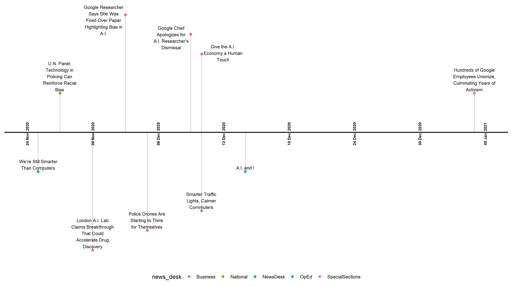

I recently posted a [new package to my github called ggtimeline](https://github.com/cgpeltier/ggtimeline), which uses `ggplot2` to easily produce timeline charts.

When I was a defense analyst on the consulting team at Janes, I occasionally needed to create event timelines for presentations or reports. Following a post from [Ben Alex Keen](https://benalexkeen.com/creating-a-timeline-graphic-using-r-and-ggplot2/), I created this package so that others might be able to create timelines more easily. 

Here's the full code, as it stands now. I'm planning to add more customization options in the future and would appreciate any collaboration from others who're interested in contributing! 

```{r eval=FALSE}

ggtimeline <- function(df, date_col, title_col, color_col = NULL,
                       time_span, time_space,
                       positions = c(0.5, -0.5, 1.0, -1.0, 1.25, -1.25, 1.5, -1.5)){

    directions <- c(1, -1)

    length_dates <- df %>% pull({{date_col}}) %>% length()

    df2 <- df %>%
      mutate(position = rep(positions, length.out = length_dates),
             direction = rep(directions, length.out = length_dates))


    min_date <- df2 %>% pull({{date_col}}) %>% min()
    max_date <- df2 %>% pull({{date_col}}) %>% max()

    if(time_span == "month"){
      date_range_df <- seq(min_date - months(1),
                           max_date + months(1),
                           by = time_span) %>%
        tibble() %>%
        rename(date_range = ".") %>%
        mutate(date_range = ymd(date_range),
               date_format = format(date_range, '%b   %Y'),
               keep = rep(as.numeric(paste(c(1, rep(0, times = time_space)))),
                          length.out = nrow(.))) %>%
        filter(keep == 1)
    }

    if(time_span == "year"){
      date_range_df <- seq(min_date - lubridate::years(1),
                           max_date + lubridate::years(1),
                           by = time_span) %>%
        tibble() %>%
        rename(date_range = ".") %>%
        mutate(date_range = ymd(date_range),
               date_format = format(date_range, '%b   %Y'),
               keep = rep(as.numeric(paste(c(1, rep(0, times = time_space)))),
                          length.out = nrow(.))) %>%
        filter(keep == 1)
    }

    if(time_span == "day"){
      date_range_df <- seq(min_date - lubridate::days(1),
                           max_date + lubridate::days(1),
                           by = time_span) %>%
        tibble() %>%
        rename(date_range = ".") %>%
        mutate(date_range = ymd(date_range),
               date_format = format(date_range, '%d %b  %Y   '),
               keep = rep(as.numeric(paste(c(1, rep(0, times = time_space)))),
                          length.out = nrow(.))) %>%
        filter(keep == 1)
    }

    name_date <- df2 %>% select({{date_col}}) %>% colnames()
    title_date <- df2 %>% select({{title_col}}) %>% colnames()


    ggplot(df2, aes_string(x = name_date, y = "position",
                          label = title_date)) +
      geom_point(size=2, aes_string(color = {{color_col}})) +
      geom_hline(yintercept=0, color = "black", size=.8) +
      geom_segment(aes_string(y="position", yend=0,xend=name_date),
                   color='black', size=0.2) +
      geom_text(data = date_range_df, aes_string(label = "date_format", x = "date_range", y = 0, angle = 90),
                size = 2.5, hjust = 0.5, fontface = "bold")
}
```


`ggtimeline` uses the following arguments:

* df: Dataframe containing the timeseries data
* date_col: Name of the column containing dates
* title_col: Name of the column containing timeline data (i.e. the text in the timeline)
* color_col: Name of the column that contains groups to color timeline points (optional)
* time_span: One of "day", "month", or "year"
* time_space: Number of days/months/years between those shown on timeline (i.e., if time_span is months, then a timespace of 2 would show January, April, July, and October for a single year)
* positions: Height positions for timeline points

It's designed so that you'd follow a `ggtimeline()` call with a `geom_text()` or `ggrepel::geom_text_repel()` function to display the title_col text.

## Example usage
Here's an example using the New York Times API:

```{r eval=FALSE}
library(tidyverse)
library(jsonlite)


nyt_data <- GET(paste0("https://api.nytimes.com/svc/search/v2/articlesearch.json?q=artificial%20intelligence&api-key=", Sys.getenv("NYT_KEY"))) %>%
    content(as = "text") %>%
    fromJSON(simplifyDataFrame = TRUE)

nyt_data2 <- nyt_data$response$docs

headlines <- nyt_data2$headline %>% select(main)

## clean data from API using janitor and lubridate. Note the use of stringr::str_wrap to make sure timeline text is wrapped.    
nyt_data3 <- nyt_data2 %>% 
    janitor::clean_names() %>% 
    bind_cols(headlines) %>% 
    mutate(pub_date = as.Date(lubridate::ymd_hms(pub_date)),
           abstract = str_wrap(abstract, 20),
           main_headline = str_wrap(main, 20)) %>% 
    arrange(desc(pub_date))


## make timeline chart
ggtimeline(nyt_data3, date_col = "pub_date", title_col = "main_headline", color_col = "news_desk", time_span = "day", time_space = 5) +
    ggrepel::geom_text_repel(size = 3, vjust = 1) +
    theme_classic() +
    theme(axis.line.y=element_blank(),
          axis.text.y=element_blank(),
          axis.title.x=element_blank(),
          axis.title.y=element_blank(),
          axis.ticks.y=element_blank(),
          axis.text.x =element_blank(),
          axis.ticks.x =element_blank(),
          axis.line.x =element_blank(),
          legend.position = "bottom")
```

{width=90% height=90%}


