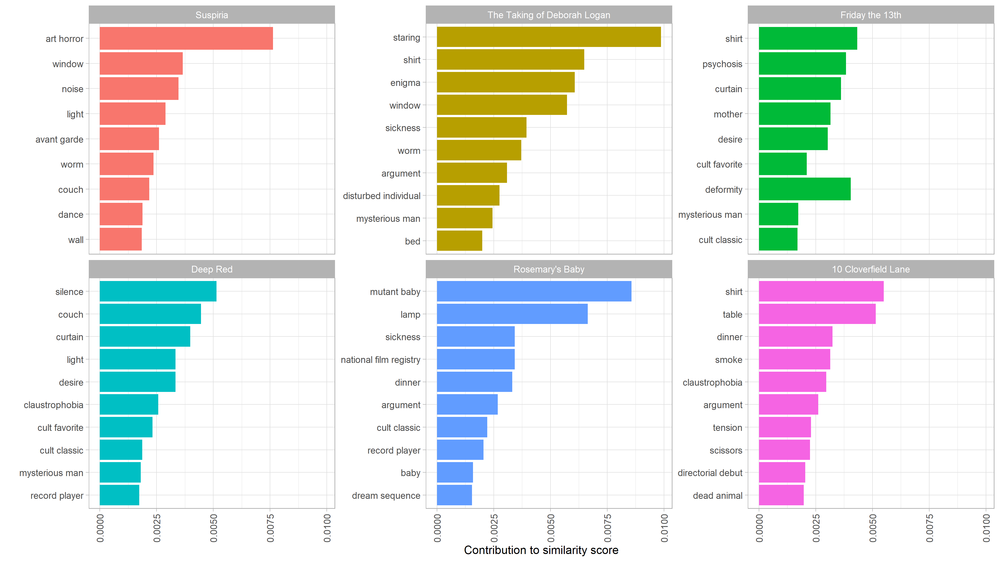

Since college, my friends and I have had scary movie nights where we watch a different horror movie. I tend to like supernatural horror movies, zombie movies, and anything that is surreal/dream-like, like Twin Peaks. I'm not as in to slashers, true crime, anything *Saw*-like, or body horror movies. However, just going through the top horror movies on Rotten Tomatoes or IMDB doesn't always align with our group's tastes. 

So this project is intended to analyze horror movies in more detail, using their keyword descriptors and other metadata to create better recommendations. 

To start out, I scraped IMDB for all horror movies with at least 25,000 ratings (which is about 700 of them). I then analyze the resulting metadata, and finally I created a Shiny app, which is [available here](https://chad-peltier.shinyapps.io/horror_movies/). 

The app allows you to see movies filtered using a subset of IMDB keywords, rated by their IMDB score and the year they were released, as well as a separate tab showing movie recommendations based on cosine similarity networks (top 10 most similar movies).

```{r message=FALSE}
library(tidyverse)
library(httr)
library(rvest)
library(janitor)
library(furrr)
library(tidymodels)
library(textrecipes)
library(tidytext)
library(widyr)
library(corrr)
library(lubridate)
library(here)
```


# Scrape IMDB

First is scraping IMDB. The first thing we'll do is pull links to each movie's IMDB page. This is pretty straightforward -- writing a function to pull links, which can then be looped across the URLs using `purrr::map_dfr`.

```{r eval=FALSE}

## make function
get_imdb_id <- function(page){
  
    read_html(paste0("https://www.imdb.com/search/title/?title_type=feature&num_votes=25000,&genres=horror&sort=user_rating,desc&start=", page, "&ref_=adv_nxt")) %>%
    html_nodes("a") %>%
    html_attr("href") %>%
    tibble(links = .) %>%
    filter(str_detect(links, "title/tt")) %>%
    mutate(links = str_extract(links, "tt\\d+")) %>%
    distinct() 
}


## scrape all pages 
pages <- seq(from = 1, to = 700, by = 50)

horror_ids <- map_dfr(pages, get_imdb_id) 

```

The next step is to pull all relevant info from the movie's page. There's a lot of content on these pages, so a big custom function will be needed to pull each node (which I gathered using Selector Gadget). Using `furrr` to parallelize this process was key :)

Obviously the IMDB dataset is a foundational one for NLP benchmarks and research. But that one is old, and I wanted to include more recent movies. There are also several R packages that use the OMDB API, but that API is limited to 1000 calls per day (and I wasn't sure if it supported the keywords and all of the other data available by scraping the website). 

```{r eval=FALSE}

url <- "https://www.imdb.com/title/tt1073105/"

get_imdb <- function(url){
    title <- read_html(url) %>%
        html_nodes("h1") %>%
        html_text() %>%
        tibble("title" = .) %>%
        mutate(year = str_extract(title, "\\d{4}"),
               title = str_squish(str_remove(title, "\\(\\d+\\)")))
    
    rating <- read_html(url) %>%
        html_nodes(".ratings_wrapper") %>%
        html_text() %>%
        tibble(imdb_rating = .) %>%
        mutate(imdb_rating = str_extract(imdb_rating, "\\d\\.\\d(?=\\/10)"))
    
    time <- read_html(url) %>%
        html_nodes("time") %>%
        html_text() %>%
        tibble(time = .)
    
    summary <- read_html(url) %>%
        html_nodes(".plot_summary") %>%
        html_text() %>%
        tibble("summary" = .) %>% 
        mutate(summary = str_trim(summary),
               summary = str_remove_all(summary, "[\r\n\t]"),
               directors = str_trim(str_extract(summary, "(?<=Directors{0,1}:)[\\w\\,\\s\\.]+")),
               writers = str_trim(str_extract(summary, "(?<=Writers{0,1}:)[\\w\\s\\,\\.]+")),
               directors = str_remove(directors, "\\s{2,}.+"),
               writers = str_remove(writers, "\\s{2,}.+"),
               stars = str_trim(str_extract(summary, "(?<=Stars:)[\\w\\s\\,\\.]+")),
               summary = str_remove(summary, "\\s{2,}Director.+"))  
    
    score <- read_html(url) %>%
        html_nodes(".metacriticScore") %>%
        html_text() %>%
        tibble("metacritic_score" = .) %>%
        mutate(metacritic_score = str_remove_all(metacritic_score, "[\r\n\t]"))
    
    story <- read_html(url) %>%
        html_nodes("#titleStoryLine") %>%
        html_text() %>%
        tibble("story" = .) %>%
        mutate(story = str_squish(str_remove_all(story, "[\r\n\t]")),
               genres = str_extract(story, "(?<=Genres{0,1}: )[\\w\\s\\|\\-]+"),
               genres = str_remove(genres, "Certificate"),
               genres = str_remove(genres, "Motion Picture Rating"),
               story = str_remove(story, "Edit Storyline "),
               story = str_remove(story, "Plot Summary.+"),
               story = str_remove(story, "Written by.+")) 
    
    id <- tibble(id = str_extract(url, "tt\\d+"))
    
    details <- read_html(url) %>%
        html_nodes("#titleDetails") %>%
        html_text() %>%
        tibble("details" = .) %>%
        mutate(gross_usa = parse_number(str_extract(details, "(?<=Gross USA: \\$)[\\d\\,]+")),
               gross_world = parse_number(str_extract(details, "(?<=Cumulative Worldwide Gross: )[\\$\\d\\,]+")),
               runtime = str_extract(details, "(?<=Runtime:\\s{9})\\d+"),
               language = str_extract(details, "(?<=Language:\\s{9})\\w+")) %>%
        select(-details) 
    
    if(nrow(score)==0){score <- tibble(metacritic_score = NA_character_)}

    bind_cols(id, title, rating, score, details, summary, story)
    
}
  
possibly_get_imdb <- possibly(get_imdb, NULL)


## map across URLs
horror_ids2 <- horror_ids %>%
    mutate(links = paste0("https://www.imdb.com/title/", links, "/"))


n_cores <- availableCores() - 2
plan(multiprocess, workers = n_cores)

horror_data <- future_map_dfr(horror_ids2$links,  possibly_get_imdb)


```


The next step was to pull keywords for each movie. The keywords were on a slightly different URL, so they required another loop. 

```{r eval=FALSE}
url <- "https://www.imdb.com/title/tt0054215/keywords?ref_=tt_stry_kw"

get_keywords <- function(url){
  
    id <- tibble(id = str_extract(url, "tt\\d+"))
  
    read_html(url) %>%
      html_nodes(".sodatext") %>%
      html_text() %>%
      tibble("keywords" = .) %>%
      summarize(keywords = str_squish(paste0(keywords, collapse = "|"))) %>%
      bind_cols(id, .)

}

keyword_urls <- horror_ids %>%
    mutate(links = paste0("https://www.imdb.com/title/", links, "/keywords"))


horror_keywords <- map_dfr(keyword_urls$links, get_keywords)

  
## add back to horror_data
horror2 <- left_join(horror_data, horror_keywords) %>%
    distinct()
  
```


The final step in cleaning the base data is to create dummy variable columns for all of the secondary genres (i.e. a horror-comedy or horror-action movie). 

```{r eval=FALSE}

horror3 <- horror2 %>%
    select(id, genres) %>%
    mutate(genres = str_split(genres, " | ")) %>%
    unnest(genres) %>%
    filter(!genres %in% c("|", NA_character_, "")) %>%
    mutate(count = "1") %>%
    distinct() %>%
    pivot_wider(names_from = genres, values_from = count, values_fill = "0", id_cols = id) %>% 
    rename_with(.cols = 2:ncol(.), 
                .fn = ~ str_to_lower(paste0("genre_", .))) %>%
    left_join(horror2 %>% select(-genres), .) %>%
    mutate(across(c(year, imdb_rating, metacritic_score, runtime), as.numeric))

```


```{r include=FALSE, eval=FALSE}
horror_new <- horror3 %>%
  recipe(~ year + imdb_rating + metacritic_score + gross_world + id , data = .) %>%
  update_role(id, new_role = "id") %>%
  step_knnimpute(metacritic_score, gross_world, neighbors = 3) %>%
  prep() %>%
  bake(new_data = NULL) %>%
  select(-c(year, imdb_rating), id) %>%
  left_join(horror3 %>% select(-c(metacritic_score, gross_world)), .)
```


# Cosine similarity
David Robinson's excellent `widyr` package makes document similarity through cosine similarity (or in this case, movie keyword similarity) easy. First, I unnested the tokens from the keywords column, then add tf-idf scores. Then I just needed to use the `widyr::pairwise similarity` function to calculate movie similarity based on those keywords. 

The keywords themselves are all over the place. Some are generic, some are related to the director or the actors, some have plot points or film techniques... it's really a mixed bag. Nevertheless, I think the results are pretty good. 

```{r message=FALSE, eval=FALSE}

## create unnested token df 
horror_words <- horror3 %>%
    select(id, keywords) %>%
    unnest_tokens(word, keywords, token = "regex", pattern = " \\| ") %>%
    filter(word != "reference") %>%
    count(id, word, sort = TRUE) %>%
    bind_tf_idf(word, id, n) %>%
    arrange(desc(tf_idf))

## create similarity df
horror_sim <- horror_words %>%
    pairwise_similarity(id, word, tf_idf, upper = FALSE, sort = TRUE) %>%
    left_join(horror3 %>% 
                  select(id, title1 = title, imdb_rating1 = imdb_rating, keywords1 = keywords), 
              by = c("item1" = "id")) %>%
    left_join(horror3 %>% 
                  select(id, title2 = title, imdb_rating2 = imdb_rating),
              by = c("item2" = "id"))

```


```{r include=FALSE}

horror3 <- read_csv("C:/data_projects/janes_data/data/personal_site/horror3.csv")
horror_sim <- read_csv("C:/data_projects/janes_data/data/personal_site/horror_sim.csv")

```


For example, the movie combinations that have the highest overall similarity are either remakes, sequels, or other-language versions of the same movie:

```{r}
horror_sim %>%
    head() %>%
    select(title1, title2, similarity)
```


Next, I made a function to show the top 10 most similar movies to your search, with the fill color based on their IMDB ratings. 

```{r}
## function to visualize most similar movies
make_similar_chart <- function(movie) {
  
  horror_sim %>%
    filter(title1 == movie) %>%
    top_n(n = 10, wt = similarity) %>%
    select(title1, title2, similarity, imdb_rating1, imdb_rating2) %>%
    ggplot(aes(similarity, reorder(title2, similarity), fill = imdb_rating2)) +
    geom_col() +
    labs(y = "", fill = "IMDB Rating", title = paste("Similar Movies to", movie)) +
    theme_classic()
  
}

make_similar_chart("Eraserhead")

```

Eraserhead, one of my favorite scary movies, has some great recommendations. I haven't seen The Taking of Deborah Logan, so that's a good recommendation (even if its IMDB rating is on the lower side). But I really liked Suspiria, and Deep Red has been on my list for a while (since I watched the original Suspiria!). I also *loved* Annihilation (the shots of the fingerprints moving around, or the girl transforming into the tree were haunting!).

Based on [David's article on who wrote the "Anonymous" letter in the *New York Times*](http://varianceexplained.org/r/op-ed-text-analysis/), I also made a function to show the keywords that influenced the similarity scores for a movie's top matches. The code below is largely taken from David:

```{r eval=FALSE}

## Words contributing to similarity scores
word_similarities <- function(movie) {
  tf_idf <- horror_words %>%
      left_join(horror3 %>% select(id, title)) %>%
      group_by(title) %>%
      mutate(normalized = tf_idf / sqrt(sum(tf_idf ^ 2))) %>%
      ungroup()
  
  word_combinations <- tf_idf %>%
      filter(title == movie) %>%
      select(-title) %>%
      inner_join(tf_idf, by = "word", suffix = c("_movie", "_similar")) %>%
      filter(title != movie) %>%
      mutate(contribution = normalized_movie * normalized_similar) %>%
      arrange(desc(contribution)) %>%
      select(title, word, tf_idf_movie, tf_idf_similar, contribution)
  
  word_combinations %>%
      filter(title %in% head(horror_sim %>% filter(title1 == movie) %>% pull(title2))) %>%
      mutate(title = reorder(title, -contribution, sum),
             word = reorder_within(word, contribution, title)) %>%
      group_by(title) %>%
      top_n(10, contribution) %>%
      ungroup() %>%
      mutate(word = reorder_within(word, contribution, title)) %>%
      ggplot(aes(word, contribution, fill = title)) +
      geom_col(show.legend = FALSE) +
      scale_x_reordered() +
      facet_wrap(~ title, scales = "free_y") +
      coord_flip() +
      labs(x = "",
           y = "Contribution to similarity score") +
      theme_light() +
      theme(axis.text.x = element_text(angle = 90, vjust = 0.5, hjust=1)) 
}


word_similarities("Eraserhead")

```




Next, we can also do some unsupervized learning using LDA to see if there are any horror subgenres that emerge from their keywords:

```{r eval=FALSE}
## LDA
library(topicmodels)

h_dtm <- horror3 %>%
    rename(text = keywords) %>% 
    unnest_tokens(word, text) %>%
    anti_join(stop_words, by = "word") %>%
    count(title, word, sort = TRUE) %>%
    filter(!word %in% c("reference")) %>%
    cast_dtm(title, word, n) 
    

h_lda <- LDA(h_dtm, k = 10, control = list(seed = 123))


h_topics <- h_lda %>%
    tidy(matrix = "beta")
```


```{r include=FALSE}
# write_csv(h_topics, file = "h_topics.csv", na = "")

h_topics <- read_csv("C:/data_projects/janes_data/data/personal_site/h_topics.csv")
```


```{r}

h_topics %>%
    filter(topic != 3) %>%
    group_by(topic) %>%
    top_n(10, abs(beta)) %>%
    ungroup() %>%
    arrange(topic, desc(beta)) %>%
    mutate(term = reorder_within(term, beta, topic)) %>%
    ggplot(aes(beta, term, fill = factor(topic))) +
    geom_col(show.legend = FALSE) +
    facet_wrap(~ topic, scales = "free", ncol = 3) +
    scale_y_reordered() +
    theme(axis.title.x=element_blank(),
        axis.text.x=element_blank(),
        axis.ticks.x=element_blank())

```

Pretty interesting! Topic 1 seems to be about ghostly children (like *The Omen*, I'm guessing!). Topic 2 might be zombie-related, 4 looks like true-crime/serial killer kind of stuff, as does 7 (which brings in detectives to the mix). 8 is space-related horror (*Alien*!), and 10 is vampires! 

```{r include=FALSE}

customjs2 <- '
function(el,x) { 
    var link = d3.selectAll(".link")
    var node = d3.selectAll(".node")

    var options = { opacity: 1,
                    clickTextSize: 10,
                    opacityNoHover: 0.1,
                    radiusCalculation: "Math.sqrt(d.nodesize)+6"
                  }

    var unfocusDivisor = 4;

    var links = HTMLWidgets.dataframeToD3(x.links);
    var linkedByIndex = {};
    

    links.forEach(function(d) {
      linkedByIndex[d.source + "," + d.target] = 1;
      linkedByIndex[d.target + "," + d.source] = 1;
    });

    function neighboring(a, b) {
      return linkedByIndex[a.index + "," + b.index];
    }

    function nodeSize(d) {
            if(options.nodesize){
                    return eval(options.radiusCalculation);
            }else{
                    return 6}
    }

    function mouseover(d) {
      var unfocusDivisor = 4;

      link.transition().duration(200)
        .style("opacity", function(l) { return d != l.source && d != l.target ? +options.opacity / unfocusDivisor : +options.opacity });

      node.transition().duration(200)
        .style("opacity", function(o) { return d.index == o.index || neighboring(d, o) ? +options.opacity : +options.opacity / unfocusDivisor; });

      d3.select(this).select("circle").transition()
        .duration(750)
        .attr("r", function(d){return nodeSize(d)+5;});

      node.select("text").transition()
        .duration(750)
        .attr("x", 13)
        .style("stroke-width", ".5px")
        .style("font", 24 + "px ")
        .style("opacity", function(o) { return d.index == o.index || neighboring(d, o) ? 1 : 0; });
        
    }

    function mouseout() {
      node.style("opacity", +options.opacity);
      link.style("opacity", +options.opacity);

      d3.select(this).select("circle").transition()
        .duration(750)
        .attr("r", function(d){return nodeSize(d);});
      node.select("text").transition()
        .duration(1250)
        .attr("x", 0)
        .style("font", options.fontSize + "px ")
        .style("opacity", 0);
    }

  
      var svg = d3.select(el).select("svg");
      var mouseout = d3.selectAll(".node").on("mouseout");
      
      
      function mouseout_clicked(d) {
        node.style("opacity", +options.opacity);
        link.style("opacity", +options.opacity);
    
        d3.select(this).select("circle").transition()
          .duration(750)
          .attr("r", function(d){return nodeSize(d);});
        d3.select(this).select("text").transition()
          .duration(1250)
          .attr("x", 0)
          .style("font", options.fontSize + "px ");
      }
      
      function onclick(d) {
        if (d3.select(this).on("mouseout") == mouseout) {
          d3.select(this).on("mouseout", mouseout_clicked);
        } else {
          d3.select(this).on("mouseout", mouseout);
        }
        
        node.select("text").transition()
        .duration(750)
        .attr("x", 13)
        .style("stroke-width", ".5px")
        .style("font", 24 + "px ")
        .style("opacity", function(o) { return d.index == o.index || neighboring(d, o) ? 1 : 0; });
        
      }
      
        d3.selectAll(".node").on("click", onclick);
  
}

'
```

Next, I made similarity networks based on the top 10 most-similar movies to each movie. This allows us to see which movies are most similar to other horror movies, and which are more out-there, with fewer descriptors in common with other movies. 

```{r}
## similarity networks
library(networkD3)

movie_network <- function(movie = NULL) {
   nodes <- horror_sim %>%
    {if(is.null(movie)) horror_sim else horror_sim %>% filter(title1 %in% movie)} %>%
    select(label = title1) %>%
    bind_rows(horror_sim %>%
      {if(is.null(movie)) horror_sim %>% select(label = title2) else horror_sim %>% filter(title1 %in% movie) %>% group_by(title1) %>% arrange(desc(similarity)) %>% top_n(n = 10, wt = similarity) %>% ungroup() %>% select(label = title2)}) %>%
    distinct() %>%
    rowid_to_column("id") %>%
    mutate(id = id-1)
   

  edges <- horror_sim %>%
        {if(is.null(movie)) horror_sim %>% group_by(title1) %>% top_n(n = 10, wt = similarity) else horror_sim %>% filter(title1 %in% movie) %>% group_by(title1) %>% arrange(desc(similarity)) %>% top_n(n = 10, wt = similarity) %>% ungroup()} %>%
        select(title1, title2, similarity) %>%
        ungroup() %>%
        left_join(nodes %>% rename(from = id), by = c("title1" = "label")) %>%
        left_join(nodes %>% rename(to = id), by = c("title2" = "label")) %>%
        mutate(value2 = 1) %>%
        select(from, to, title1, title2, similarity, value2)

  htmlwidgets::onRender(forceNetwork(Links = edges,
                                       Nodes = nodes,
                                       Source = "from",
                                       Target = "to",
                                       NodeID = "label",
                                       Group = "id",
                                       Value = "similarity",
                                       opacity = 1,
                                       fontSize = 12,
                                       arrows = TRUE,
                                       zoom = TRUE), customjs2)
}


top10_horror <- horror3 %>%
    arrange(desc(imdb_rating)) %>%
    slice_head(n = 10) %>%
    pull(title)
  
  
movie_network(top10_horror)

```

Looking at this chart of the top ten highest-rated horror movies, there are some interesting suggestions and relationships here. For example:

* *The Thing* and *Alien* are densely connected. Not only are they in each others' top tens, they also share four movies in their top tens, like *Dreamcatcher* and *Alien: Covenant* that are also about aliens. Both are claustrophobic movies about aliens.
* A top-10 movie I'd never heard of before, *Tumbbad*, is less connected than most of the other top-10. In fact, only *Poltergeist*, which it shares with *The Shining*, connects it with the rest of the network. 
* Psycho is the most densely connected, with only three movies that aren't connected with other movies in the network.
* I really liked both *The Shining* and *1408*, so it would be worth exploring what else is in that network. 


# Additional EDA
Finally, we can do some additional exploratory data analysis, starting with correlations between secondary genres: 

```{r}
library(corrr)

horror3 %>%
    select(starts_with("genre"), -genre_horror) %>%
    mutate(across(everything(), as.numeric)) %>%
    correlate(quiet = TRUE) %>%
    # shave() %>%
    pivot_longer(2:ncol(.)) %>%
    drop_na() %>%
    ggplot(aes(term, name, fill = value)) +
    geom_tile() +
    scale_fill_distiller(palette = "RdBu", direction = 1) + 
    theme_classic() +
    theme(axis.text.x = element_text(angle = 90, vjust = 0.5, hjust=1)) +
    labs(x = "", y = "")

```

Unsurprising that horror-action-adventure movies are common, as are horror-family-animation movies. Horror-thriller-comedies are very uncommon.


```{r}
## imdb vs. metacritic scores
horror3 %>%
    drop_na(metacritic_score) %>%
    ggplot(aes(imdb_rating, metacritic_score)) +
    geom_point() +
    theme(axis.text.x = element_text(angle = 90, vjust = 0.5, hjust=1))

```

There's a very strong relatonship between IMDB ratings and metacritic scores, although it's clearly not a 1-1 relationship. 

```{r}
## ratings over time 
horror3 %>%
    filter(year > 1920) %>%
    ggplot(aes(year, imdb_rating, alpha = 0.4, size = 2)) +
    geom_point()+
    theme(axis.text.x = element_text(angle = 90, vjust = 0.5, hjust=1)) +
    guides(alpha = FALSE, size = FALSE)

```

There have been *a lot* of horror movies released over the last 20 years! This doesn't show much of a trend in ratings over time. We'll need to take a look at this another way. 

```{r}
## boxplots of decades 
horror3 %>%
    filter(year > 1920) %>%
    mutate(decade = (year %/% 10) * 10,
           decade = factor(decade)) %>% 
    select(title, imdb_rating, decade, gross_world) %>% 
    ggplot(aes(imdb_rating, fct_rev(decade), color = decade)) +
    # geom_point() + 
    geom_boxplot() +
    labs(x = "IMDB Rating", y = "") +
    guides(color = FALSE)

```

Grouping movies by decade shows a more clear trend. Overall the median horror movie has gotten worse by the decade, and the interquartile range has increased significantly since the 1970s. I think a lot of this has to do with the explosion in movies released, not necessarily that older movies are just better. 

Finally, we can take a look at the relationship between similarity and rating. For example, are movies that are more unique -- as measured by either a lower average similarity rating for their top ten similar movies, or in the number of other movies in which the movie is in their top ten -- rated higher?  

```{r message=FALSE}
## movies with low cosine similarity scores
sim_count <- horror_sim %>%
    group_by(item1, title1) %>%
    top_n(10, wt = similarity) %>%
    ungroup() %>%
    count(title2, item2, sort = TRUE, name = "n_top_tens")

horror_most_similar <- horror_sim %>%
    group_by(item1, title1) %>%
    top_n(10, wt = similarity) %>% 
    summarize(avg_similarity = mean(similarity)) %>% 
    left_join(sim_count, by = c("item1" = "item2")) %>% 
    left_join(horror_sim %>% select(item1, title1, imdb_rating1)) %>%
    select(-title2) %>%
    mutate(n_top_tens = replace_na(n_top_tens, 0)) %>%
    distinct() %>%
    arrange(desc(avg_similarity))
 

## similarity vs. rating
horror_most_similar %>%
    filter(title1 %in% c("Eraserhead", "Saw", "Night of the Living Dead", "The Purge", 
                         "Friday the 13th", "Alien", "The Exorcist", "The Omen", 
                         "Blair Witch", "A Nightmare on Elm Street", "Paranormal Activity", 
                         "The Babadook", "Suspiria", "The Conjuring", "Midsommar",
                         "Rosemary's Baby", "The Lighthouse", "Us", "Get Out", "Mother!",
                         "What We Do in the Shadows")) %>%
    ggplot(aes(avg_similarity, imdb_rating1, size = n_top_tens, 
               color = n_top_tens, label = title1, alpha = 0.9)) +
    geom_point() +
    ggrepel::geom_text_repel(aes(size = 8)) +
    theme_classic() +
    guides(alpha = FALSE, color = FALSE, size = FALSE) +
    labs(y = "IMDB Rating", x = "Avg Similarity", title = "Average Similarity vs. IMDB Rating",
         subtitle = "Circle size represents the number of top ten similarity scores that movie is in")


```

I pulled out a sample of interesting movies for this chart so it's not too crowded. It shows that there is definitely a cluster of highly-rated and more unique movies, like *What We Do in the Shadows*, *Get Out*, *The Lighthouse*, and *Eraserhead*. It's also interesting to see movies that have a low average similarity with their top ten, but are still in a lot of other movies' top tens, like *Suspiria* and *Night of the Living Dead* (the original). These have really defining features, like *Suspiria's* giallo aspects, that distinguish them from other zombie and witch movies. 


Please also check out [my Shiny app](https://chad-peltier.shinyapps.io/horror_movies/) for more! 


